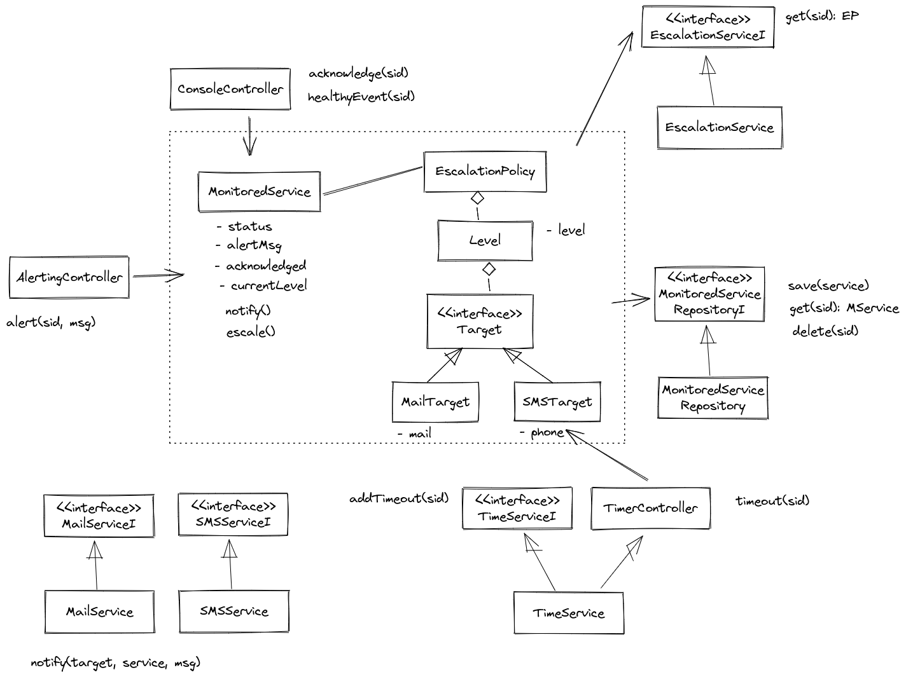

# Model design

This is the class diagram built with [Excalidraw](https://excalidraw.com/):




This design follows a DDD architecture with the model classes in the core of the application.
There are two types of adaptors:

* `Controllers`: They are the entry points of the system
that use the model classes.
In a real environment, for example if the system offers
an REST API, we will need an extra layer with an API controller
that would process the HTTP request and call the app controllers
defined here.
* `Services`: They are the external components.
All the interactions are done using interfaces to follow
the dependency inversion principle.


# Implementation

I have chosen node.js and typescript to implement this Homework.
The testing library used is [jest](https://jestjs.io/).


# Testing

While developing I have followed a TDD approach,
I have created a test for each one of the use cases described
in the instructions, and then completed the implementation
of the classes presented in the class diagram.

Since I have only defined interfaces for the adapters
but no real implementations,
I have created simple mocks of those classes to run the code
and check the model is modified as expected.


# Service Provider

This system uses multiple external services.
To manage that, I have created a `ServiceProvider` that
centralizes the actual implementation used for the adapters.

I have chosen this approach instead of using dependency injection
because I think this is simpler and I can easily mock the
adapters in the tests.


# Database guarantees

The `MonitoredServiceRepository` would be the class that
implements the database accesses.
There are two main operations: retrieve and save/update
a monitored service.

I am only considering storing the monitored service status
(the policies are retrieved from the policy service when needed),
so if this is implemented using a relational DB,
a single table will be enough.
This table would have the monitored service id as unique key,
I am using a string as type, we could use uuid for this.

There could be problems with race conditions if two requests
are processed in parallel. For example two calls to the
`AlertingController` could retrieve the same monitored service
with healthy status and duplicate the notifications.
This could be avoided using transactions for the particular
monitored service.
Or it can be avoided limiting concurrent request in the
API controller layer.


# Running

This is a node.js application. The tests are running using the jest library.
Usage:

```bash
# Install the npm dependencies
npm ci
# Run the tests
npm test
```


# Limitations/Possible improvements

* Changes on the Escalation Policies while a monitored service is in a unhealthy status is not supported.  
* Possible race conditions when accessing DB.
* Mocks are duplicated in different tests.

# Use Cases

This is this the numbered list of use cases taken from the instructions.

**UC-1**
```
Given a Monitored Service in a Healthy State,
when the Pager receives an Alert related to this Monitored Service,
then the Monitored Service becomes Unhealthy,
the Pager notifies all targets of the first level of the escalation policy,
and sets a 15-minutes acknowledgement delay
```

**UC-2**
```
Given a Monitored Service in an Unhealthy State,
the corresponding Alert is not Acknowledged
and the last level has not been notified,
when the Pager receives the Acknowledgement Timeout,
then the Pager notifies all targets of the next level of the escalation policy
and sets a 15-minutes acknowledgement delay.
```

**UC-3**
```
Given a Monitored Service in an Unhealthy State
when the Pager receives the Acknowledgement
and later receives the Acknowledgement Timeout,
then the Pager doesn't notify any Target
and doesn't set an acknowledgement delay.
```

**UC-4**
```
Given a Monitored Service in an Unhealthy State,
when the Pager receives an Alert related to this Monitored Service,
then the Pager doesn’t notify any Target
and doesn’t set an acknowledgement delay
```

**UC-5**
```
Given a Monitored Service in an Unhealthy State,
when the Pager receives a Healthy event related to this Monitored Service
and later receives the Acknowledgement Timeout,
then the Monitored Service becomes Healthy,
the Pager doesn’t notify any Target
and doesn’t set an acknowledgement delay
```